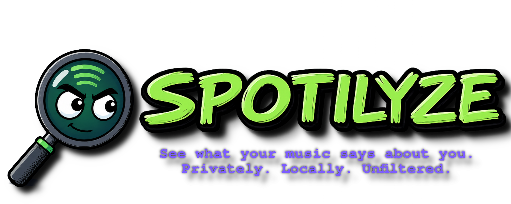
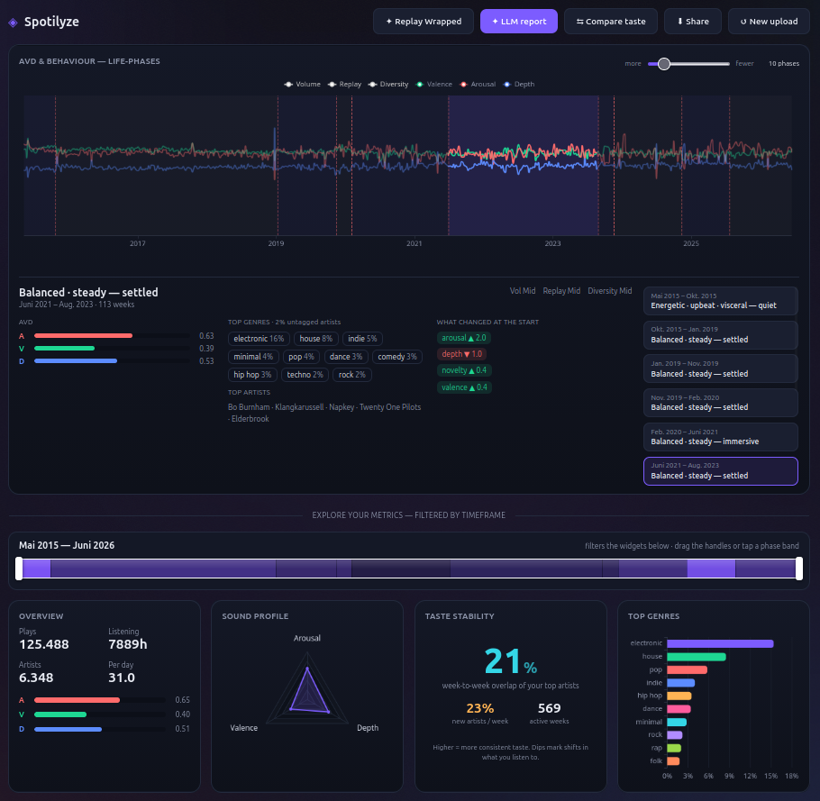
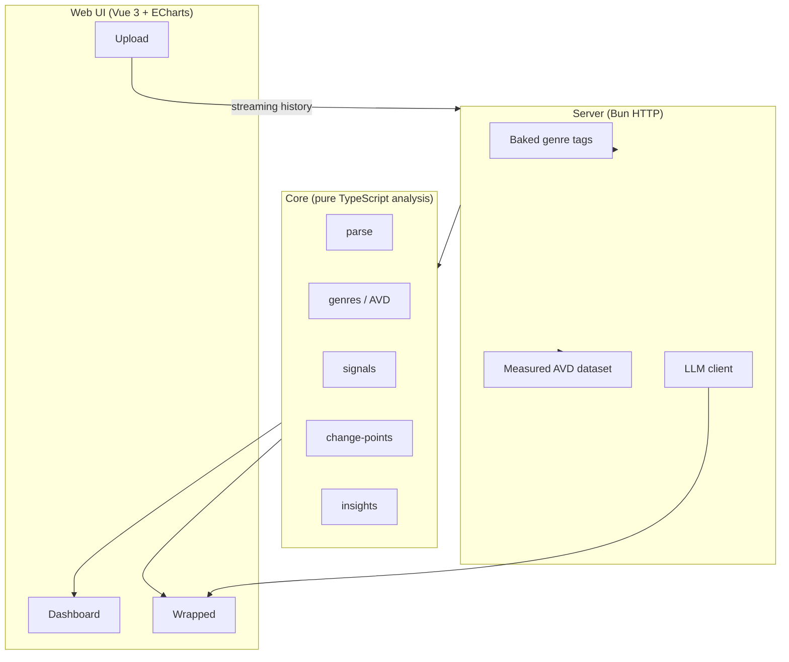

<div align="center">



A local-first tool that turns your Spotify history into a sound-profile, a timeline of how your taste shifted, and an optional AI write-up, all on your own machine.

[](https://bun.sh)
[](https://vuejs.org)
[](https://www.typescriptlang.org)
[](LICENSE)

</div>

> Spotilyze reads your Spotify *Extended Streaming History* and looks for patterns in it: what your listening sounds like, when it changed, and what a model might guess about you from it. It runs entirely on your machine. Everything it shows you is **inference, not fact**: sometimes sharp, often confidently wrong, never verified.

---

## Built with AI

> **Heads-up, up front:** Spotilyze is a hobby project built with the use of AI: most of the implementation, much of the copy, and this README. The architecture and design choices, the methodology, the dataset curation, and the review were processed by a human brain (me); Read it as exactly that: an open, AI-assisted side project, not production software vetted by a team.

---

## What it does

Drop in your export and Spotilyze runs a few analyses over it:

- **🌀 Finds where your listening shifted.** Change-point detection flags the weeks your taste changed direction. It detects the *shift*. **You** decide what it lined up with (a move, a new scene, a breakup, the lockdown year, just growing up). It finds the pattern, not the cause.
- **🎚️ Plots a sound-profile (AVD).** Each track is placed on **Arousal · Valence · Depth** (a heuristic drawn from music-and-personality research), so you can watch your sonic character drift across the years.
- **🪞 Surfaces patterns you might not notice.** Songs you binged into the ground, artists you quietly stopped playing, when you actually listen (mornings vs. late nights), how your weeks are shaped.
- **🎯 A "what an ad platform might guess" read.** A toy profile (inferred age, interests, subcultures, "in-market" categories), meant as a demo of how much leaks from listening data, not an accurate ad profile.
- **🧬 An optional AI write-up.** Point it at a local model or your own API key for a written personality read, or a roast, a dating read, or recommendations.

The point isn't to be *told* who you are. It's to see what your data hints at, and decide for yourself what (if anything) it means.

---

## What it isn't

To be upfront, so nobody mistakes this for more than it is:

- **Not validated science.** The link between listening behavior and psychology (personality, mood, even depression symptoms) is a real, active research area (see [References](#references)), and Spotilyze is *inspired by* that work. But it is **not** a clinical, diagnostic, or peer-reviewed instrument. It hasn't been validated against anything. It can surface patterns the literature treats as meaningful; it can't tell you what they mean for *you*.
- **Inference, not measurement.** The sound-profile, the "ad read", and especially the LLM write-up are guesses. Treat them as a mirror to think with, not a verdict.
- **A hobby project, AI-assisted.** See above; it's open so you can check the methodology yourself, not so you mistake it for vetted software.
- **Not affiliated with Spotify.** The measured audio data is a best-effort dataset and is imperfect.

---

## Why I built it

I was curious how much you can actually infer from a listening history. I got results on my own data, and a few friends', that were more readable than I expected, so I cleaned it up, wrote down the methodology, and put it online for others to try and for anyone to read or fork the code. That's it. It's free, it collects nothing, and it's not selling you anything.

---

## Privacy

Spotilyze is built the opposite way to the systems it borrows ideas from.

- **🔒 Private by default.** Your export is processed on your device. Nothing leaves it, unless *you* choose a cloud AI provider, in which case only the listening summary is sent, to the provider you picked.
- **🚫 Collects nothing.** No account, no tracking, no upload endpoint. The app never phones home.
- **📖 Open-source (AGPL-3.0).** Every claim here is verifiable in the code, and the copyleft license keeps it that way: anyone who builds on it, even as a hosted service, must keep their version open too.

(One thing I'd like to explore down the line: whether a small open model could do the written read fully locally, so even the optional AI step needs nothing external. Not there yet.)

---

## ✨ Feature tour

<div align="center">
    
</div>

- **AVD sound-profile**: Arousal, Valence, and Depth, measured per play and tracked over time.
- **Life-phase detection**: change-point detection that finds the periods where your listening shifted.
- **Interactive dashboard**: timeframe slider, top artists/genres/tracks, mood-by-month, time-of-day heatmap, genre evolution, taste stability.
- **Wrapped recap**: personality read, turning-point summaries; runs with or without an LLM.
- **LLM report**: multiple personas, Analyst, Ad profile, Dating read, Roast, Recommendations.
- **Insights**: obsessions, rediscoveries, outgrown tracks, podcasts, circadian patterns.
- **Taste comparison**: compare your history with a friend's export.
- **One-file HTML export**: share an interactive, offline profile that opens anywhere.

---

## ⭐ Quickstart (recommended, no coding needed)

The easiest, most foolproof way to run Spotilyze. You don't need to know any code.

**Before you start**, request your data from Spotify (it can take a few days to arrive):
[Spotify → Privacy settings](https://www.spotify.com/account/privacy/) → tick **Extended streaming history** → Request.
You'll get an email with a `.zip`, keep it, you'll drop it into the app at the end.

We also provide a [**⬇ Synthesized Example Dataset**](https://raw.githubusercontent.com/flaser381/spotilyze/refs/heads/main/example/synthesized_example_dataset.zip) created by merging multiple real Spotify data samples (excluding podcasts). You can use it to explore the app's functionality while waiting for your own data to arrive.

### 1. Install Docker Desktop

Download and install it, then **open it** and wait until the whale icon says it's running.
→ [Get Docker Desktop](https://www.docker.com/products/docker-desktop/) (Windows / Mac / Linux)

### 2. Download Spotilyze

[**⬇ Download the ZIP**](https://github.com/flaser381/spotilyze/archive/refs/heads/main.zip), then unzip it.
You'll get a folder called `spotilyze-main`.

### 3. Open a terminal in that folder

- **Windows:** open the `spotilyze-main` folder, click the address bar at the top, type `cmd`, press Enter.
- **Mac:** right-click the `spotilyze-main` folder → *New Terminal at Folder*.
- **Linux:** right-click inside the folder → *Open Terminal here*.

### 4. Start the app

Paste this and press Enter (the first run builds the app, give it a few minutes):

```bash
docker compose up -d --build
```

### 5. Open it

Go to **[http://localhost:3001](http://localhost:3001)** in your browser. A short guided setup walks you through it:

1. Choose if (and how) you want AI: skip it, use a local model, or paste your own key. **Genres work out of the box, no API key, no setup.**
2. Drag your Spotify export `.zip` onto the upload box.
3. Wait for it to crunch your history, then explore. 🎉

> **Stop it:** `docker compose down` · **Start again later:** `docker compose up -d` ·
> **Update:** download a fresh ZIP and re-run step 4. Your data and settings are kept.
>
> AI features (the written personality read) are **optional**, skip them and everything else still works.
> Want to use them with a local model like Ollama? See [Local LLMs from a container](#local-llms-ollama--lm-studio-from-a-container).

---

## Install from source (for developers)

Prefer running it directly? You need **[Bun](https://bun.sh)** installed.

```bash
# 1. Clone the repo
git clone https://github.com/flaser381/spotilyze.git
cd spotilyze

# 2. Install dependencies
bun install

# 3. configure in the in-app onboarding when you first open it,
#    or pre-seed via env vars: LLM_PROVIDER, LLM_MODEL, LLM_API_KEY, LLM_BASE_URL
```

---

## 🎬 Quick start

### Run the full app

```bash
bun run app
```

This builds the frontend and starts the server on [http://localhost:3001](http://localhost:3001).

### Development mode (hot reload)

```bash
bun run server   # API on :3001
bun run web      # Vite dev server on :5173, proxies /api → :3001
```

### First run

1. Open [http://localhost:3001](http://localhost:3001).
2. Walk through the guided onboarding (pick your AI option, or none).
3. Drag your Spotify **Extended Streaming History** export (`.zip` or `Streaming_History_Audio_*.json`) onto the upload area.
4. Wait for analysis, then explore your dashboard.

---

## Docker

No Bun install needed, run the whole app in a container.

### docker compose (recommended)

```bash
docker compose up -d --build
```

Then open [http://localhost:3001](http://localhost:3001). Your settings and the
resolved genre cache are persisted to `./config` and `./cache` on the host (bind-mounted),
so they survive restarts and re-builds.

### Plain docker

```bash
docker build -t spotilyze:latest .

docker run -d --name spotilyze -p 3001:3001 \
  --add-host=host.docker.internal:host-gateway \
  -v "$(pwd)/config:/app/config" \
  -v "$(pwd)/cache:/app/cache" \
  spotilyze:latest
```

Configure everything in the in-app **onboarding** (written into the mounted `config/`),
or pre-seed with environment variables: `LLM_PROVIDER`, `LLM_MODEL`,
`LLM_API_KEY`, `LLM_BASE_URL` (see the commented block in [`docker-compose.yml`](docker-compose.yml)).

### Local LLMs (Ollama / LM Studio) from a container

A model server running on your **host** isn't on the container's `localhost`. Two things are needed:

1. **Reach the host**: the container exposes it as `host.docker.internal` (compose sets this
   automatically; plain `docker run` needs `--add-host=host.docker.internal:host-gateway`).
   The server then auto-rewrites a `localhost` LLM base URL to `host.docker.internal`, so you
   can leave the Ollama base URL at its default, no change needed.
2. **Let the host accept it**: Ollama binds to `127.0.0.1` by default and will refuse outside
   connections. Start it listening on all interfaces:

   ```bash
   OLLAMA_HOST=0.0.0.0 ollama serve
   ```

> Multi-stage build: stage 1 builds the Vue bundle, the runtime image only ships the
> server + built dashboard + genre data (~290 MB). Override the port with `-e PORT=...`.

---

## How it works

```
plays → artists → genres (baked genre tags ship with the app, no key, no live API) → genre×AVD table → per-play AVD
      → weekly signal matrix (AVD, volume, replay, genre-entropy, novelty, …)
      → sliding-window change-point detection → life-phases (characterized)
```

- **AVD** = three musical-attribute dimensions from Greenberg et al. (2016): **Arousal** (gentle↔intense), **Valence** (sonic brightness/groove, *not* emotion), **Depth** (party/danceable↔sophisticated/complex).
- **Measured AVD**: per-artist Arousal/Valence/Depth from Spotify audio analysis, used for the displayed sound-profile.
- **Genre → AVD table** (1,837 genres, in `data/spotilyze.sqlite3`): A/V seeded from the **MuSe** dataset, Depth hand-mapped from Greenberg anchors, sub-genres inherit from parents plus modifier words. Used for life-phase detection (smoother week-to-week than measured).
- **Life-phase detection**: sliding-window divergence on `[arousal, valence, depth, entropy, novelty]` with an adaptive median+k·MAD threshold. Volume and replay are excluded because they measure engagement, not life-change.

---

## Architecture



```
packages/core      pure analysis library (parse, genres, AVD, signals, change-points, phases)
apps/server        Bun HTTP API (upload, analyze, timeframe slices, phase sensitivity) + genre + LLM clients
apps/web           Vue 3 dashboard (widgets, phase-colored timeframe slider, life-phase graph, onboarding)
data/              spotilyze.sqlite3, the single shipped DB (artist tags, measured AVD, genre AVD)
```

---

## Dev scripts

```bash
bun run server      # Bun API on :3001
bun run web         # Vite dev server
bun run app         # build web + serve (production-style)
bun test            # core unit tests
```

---

## Stack

- [Bun](https://bun.sh): runtime, package manager, bundler
- [TypeScript](https://www.typescriptlang.org): entire codebase
- [Vue 3](https://vuejs.org) + [Vite](https://vitejs.dev) + [Pinia](https://pinia.vuejs.org): frontend
- [Apache ECharts](https://echarts.apache.org): visualizations
- [Last.fm](https://www.last.fm): the baked genre tags are derived from Last.fm's community tags (shipped offline; no live API, no key)
- OpenAI-compatible / Anthropic / Ollama: optional LLM features

---

## License

AGPL-3.0-or-later, see [LICENSE](LICENSE).

Spotilyze is an independent project and is not affiliated with Spotify AB.

---

## References

Spotilyze's heuristics are *inspired by* this work; it doesn't reproduce or validate any of it.

- Greenberg, Kosinski, Stillwell, Monteiro, Levitin, Rentfrow (2016). *The Song Is You: Preferences for Musical Attribute Dimensions Reflect Personality.* SPPS.
- Sust, Stachl, Kudchadker, Bühner, Schoedel (2023). *Personality Computing With Naturalistic Music Listening Behavior.* Collabra: Psychology.
- Kanagala et al. (2021). *Depression Symptoms Are Linked to Music Use.*
- MuSe, The Musical Sentiment Dataset (Çakı, Kaggle, CC BY 4.0).
</content>
</invoke>
